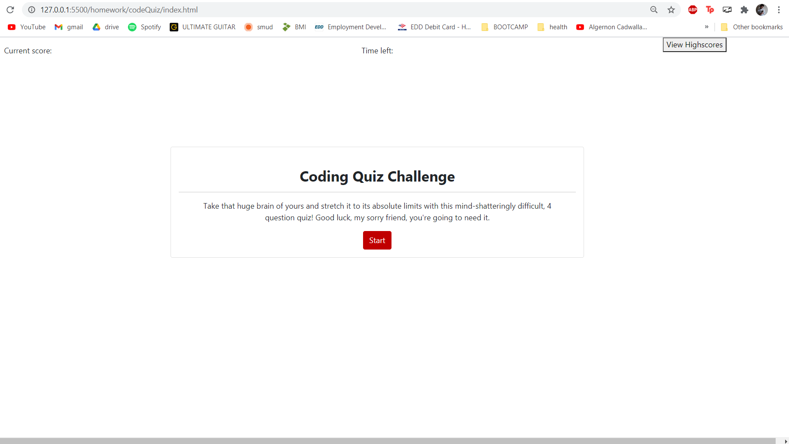
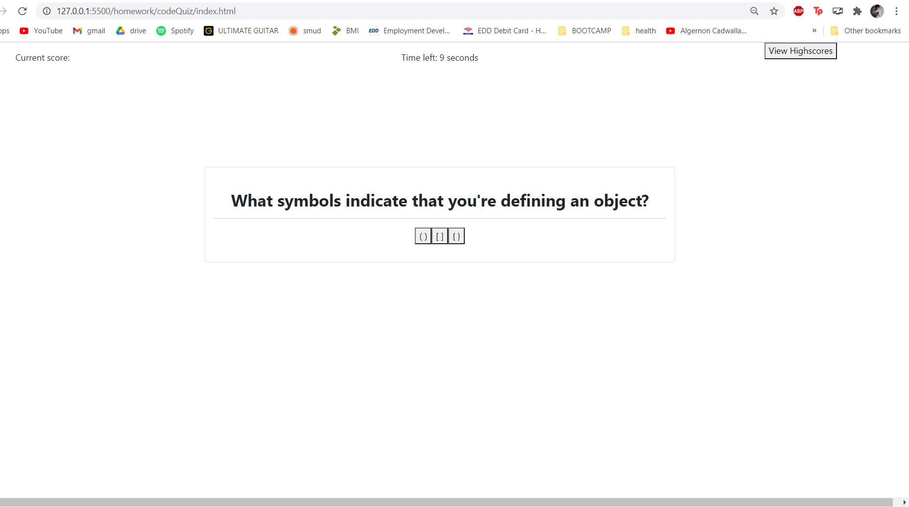
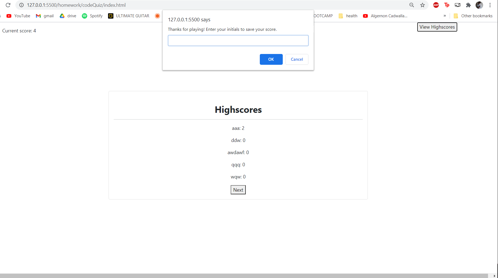
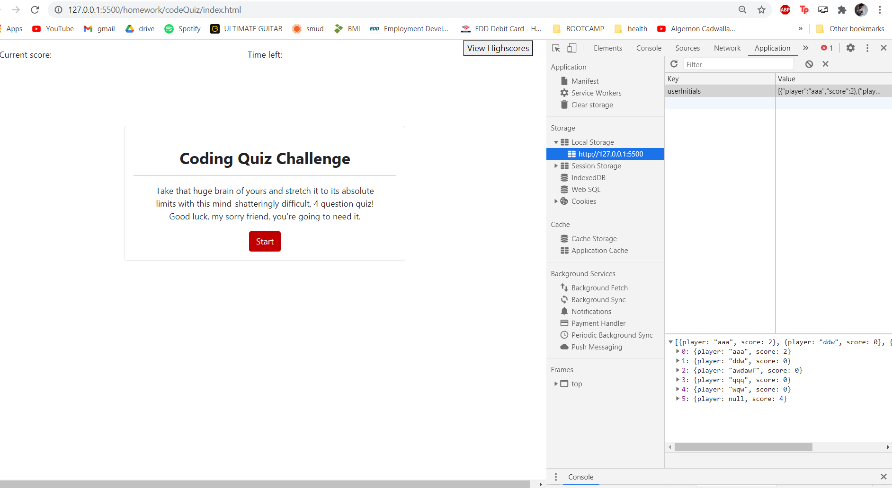

# Code Quiz

# The Assignment
Make a coding quiz with a time limit, where selecting the right answer increases your score and gives you more time, and choosing incorrectly costs you time. Also, you need to be able to save your highscores in local storage.

<!-- Screenshot of working application -->

# Installation

Simply follow this link and view the webpage.

https://dorrianweber.github.io/codeQuiz/

# Usage

* Click start to begin the quiz
* Select your answer
* Click next to progress through the quiz
* When time runs out, enter your initials to save your score
* Hit "View Highscores" to do just that

# Credits

Big thanks to my TAs Ryan Skog & Zac Warner for all their help with this assignment. Also shoutout to my friend Nick Badal who helped me out as well.